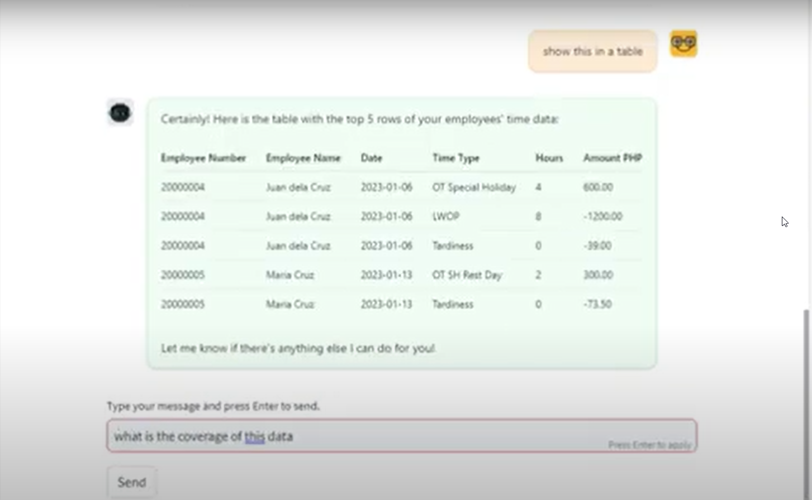

# HR AI Assistant built using the Assistants API

## Description

This is an an AI-powered HR Assistant powered by GPT-4-Turbo. It integrates a suite of tools including SAP HR for employee data retrieval, ServiceNow for ticketing information, GPT4 Vision for OCR capabilities and Code Interpreter for data analysis. Using Streamlit as frontend.


## Tech Stack

1. **Assistants API**: Orchestrates the overall system, managing interactions and data flow.
2. **GPT-4-Turbo**: Acts as the 'brain' of the system, routing to appropriate tools, synthesizing user input and tool output, and generating responses.
3. **SAP HR (via API)**: Serves as a data source for answering user queries about their own employee data.
4. **Azure SQL**: Provides data for the time data of user's direct reports. Integrates with SAP HR for data pipeline.
   - How-tos for integration: [Azure SQL Integration Guide](https://lnkd.in/gcKe_cMY)
5. **Code Interpreter**: Facilitates data analysis and visualization (e.g., using Python libraries like pandas, matplotlib) on the time data.
6. **Azure Cognitive Search (Azure AI Search)**: Functions as the vector database for HR Policy documents.
7. **LangChain**: Utilized for the vector store retriever within Azure AI Search.
8. **GPT4 Vision**: Employs Optical Character Recognition (OCR) for processing receipts.
9. **ServiceNow (via API)**: Acts as a data source for updates on ServiceNow tickets.
10. **Streamlit**: Provides a reliable and lightweight user interface.

## Installation

```bash
# Clone the repository
git clone <repository-url>

# Navigate to the project directory
cd <project-directory>

# Install required Python packages
pip install -r requirements.txt

# Set up environment variables
# Create a .env file and populate it with necessary API keys and IDs

# Run the Streamlit app
streamlit run app.py
```

## Usage

1. Start the Streamlit application.
2. Click 'New Thread' to initiate a conversation with the AI HR Assistant.
3. Type your HR-related queries or commands and receive responses or actions from the assistant.
4. The assistant can process images for OCR, fetch employee data, and handle ticket information.

## Demo - click to watch the video

[](https://youtu.be/mCm4icoRW9o)


## Author


#### Stephen Bonifacio

Feel free to connect with me on:

Linkedin: https://www.linkedin.com/in/stephenbonifacio/  
Twitter: https://twitter.com/Stepanogil

Did you find this useful? If you'd like to show some love, I won't say no to a cup of coffee! 🤗

[](https://ko-fi.com/Q5Q6QPABZ)


